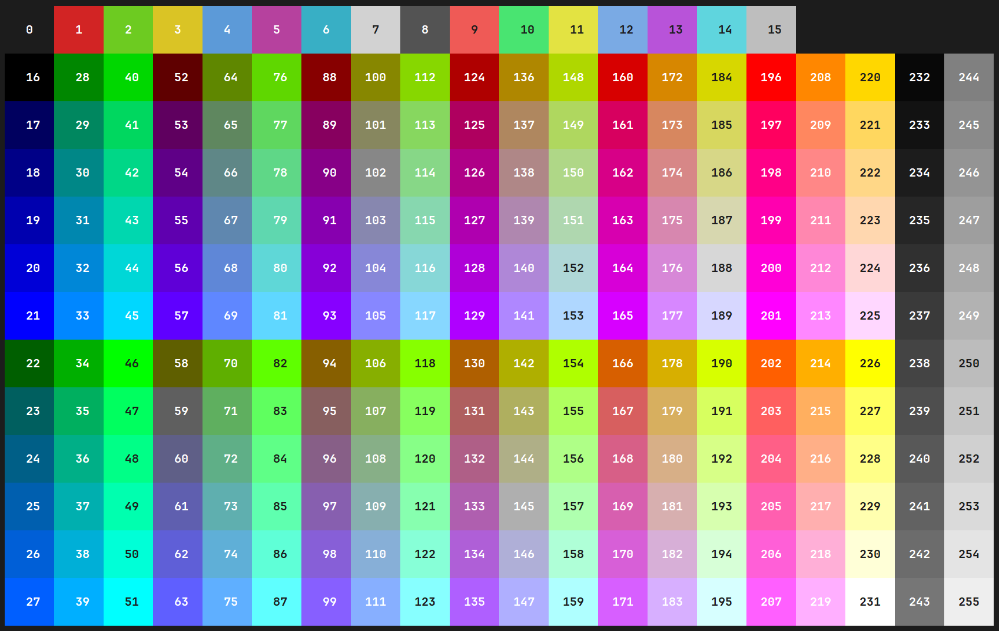

### `fmtc` color tags

#### Editors support

If you are using SublimeText 4 (`4075+`), we strongly recommend that you install [extended Go syntax highlighting](https://github.com/essentialkaos/blackhole-theme-sublime/blob/master/fmtc.sublime-syntax) with support for `fmtc` tags.


#### Environment variables

`fmtc` supports configuration via environment variables.

- `NO_COLOR` — disable all colors and modificators;
- `FMTC_NO_BOLD` — disable **bold** text;
- `FMTC_NO_ITALIC` — disable _italic_ text;
- `FMTC_NO_BLINK` — disable blinking text.

#### Modificators

| Name          | Tag   | Reset Tag | Code |
|---------------|-------|-----------|------|
| Reset         | `{!}` | —         | `0`  |
| Bold          | `{*}` | `{!*}`    | `1`  |
| Dim           | `{^}` | `{!^}`    | `2`  |
| Italic        | `{&}` | `{!&}`    | `3`  |
| Underline     | `{_}` | `{!_}`    | `4`  |
| Blink         | `{~}` | `{!~}`    | `5`  |
| Reverse       | `{@}` | `{!@}`    | `7`  |
| Hidden        | `{+}` | `{!+}`    | `8`  |
| Strikethrough | `{=}` | `{!=}`    | `9`  |

#### 8/16 Colors

##### Foreground (Text)

| Name          | Tag   | Code  | Color Preview |
|---------------|-------|-------|---------------|
| Black         | `{d}` |  `30` |  |
| Red           | `{r}` |  `31` |  |
| Green         | `{g}` |  `32` |  |
| Yellow        | `{y}` |  `33` |  |
| Blue          | `{b}` |  `34` |  |
| Magenta       | `{m}` |  `35` |  |
| Cyan          | `{c}` |  `36` |  |
| Light gray    | `{s}` |  `37` |  |
| Dark gray     | `{s-}`|  `90` |  |
| Light red     | `{r-}`|  `91` |  |
| Light green   | `{g-}`|  `92` |  |
| Light yellow  | `{y-}`|  `93` |  |
| Light blue    | `{b-}`|  `94` |  |
| Light magenta | `{m-}`|  `95` |  |
| Light cyan    | `{c-}`|  `96` |  |
| White         | `{w-}`|  `97` |  |

##### Background

| Name          | Tag   | Code   | Color Preview |
|---------------|-------|--------|---------------|
| Black         | `{D}` |  `40`  |  |
| Red           | `{R}` |  `41`  |  |
| Green         | `{G}` |  `42`  |  |
| Yellow        | `{Y}` |  `43`  |  |
| Blue          | `{B}` |  `44`  |  |
| Magenta       | `{M}` |  `45`  |  |
| Cyan          | `{C}` |  `46`  |  |
| Light gray    | `{S}` |  `47`  |  |
| Dark gray     | `{S-}`|  `100` |  |
| Light red     | `{R-}`|  `101` |  |
| Light green   | `{G-}`|  `102` |  |
| Light yellow  | `{Y-}`|  `103` |  |
| Light blue    | `{B-}`|  `104` |  |
| Light magenta | `{M-}`|  `105` |  |
| Light cyan    | `{C-}`|  `106` |  |
| White         | `{W-}`|  `107` |  |

#### 88/256 Colors



##### Foreground (Text)

Tag: `{#code}`

##### Background

Tag: `{%code}`

#### 24-bit Colors (_TrueColor_)

##### Foreground (Text)

Tag: `{#hex}`

##### Background

Tag: `{%hex}`

#### Named colors

Tag: `{?name}`

For more information about named colors see documentation for method `AddColor`.

#### Examples

```
{r*}Important!{!*} File deleted!{!}
 ┬             ┬─                ┬
 │             │                 │
 │             │                 └ Reset everything
 │             │
 │             └ Unset bold modificator
 │
 └ Bold, red text 
```

```
{rG*}OMG!{!*} Check your mail{!}
 ┬──      ┬─                  ┬
 │        │                   │
 │        │                   └ Reset everything
 │        │
 │        └ Unset bold modificator
 │
 └ Bold, red text with green background
```

```
{r}File {_}file.log{!_} deleted{!}
 ┬       ┬          ┬─          ┬
 │       │          │           │ 
 │       │          │           └ Reset everything
 │       │          │
 │       │          └ Unset underline modificator
 │       │
 │       └ Set underline modificator
 │
 └ Set text color to red
```

```
{*@y}Warning!{!@} Can't find user bob.{!}
 ┬──          ┬─                       ┬
 │            │                        │
 │            │                        └ Reset everything
 │            │
 │            └ Unset reverse modificator (keep yellow color)
 │
 └ Bold text with yellow background (due to reverse modificator)
```

```
{#213}{%240}Hi all!{!}
 ┬───  ┬───         ┬
 │     │            │
 │     │            └ Reset everything
 │     │
 │     └ Set background color to grey
 │
 └ Set text color to pink
```

```
{#ff1493}{%191970}Hi all!{!}
 ┬──────  ┬──────         ┬
 │        │               │
 │        │               └ Reset everything
 │        │
 │        └ Set background color to midnightblue
 │
 └ Set text color to deeppink
```

```
{?error}Can't find user "bob"{!}
 ┬─────                       ┬
 │                            │
 │                            └ Reset everything
 │
 │
 │
 └ Set color to named color "error"
```
